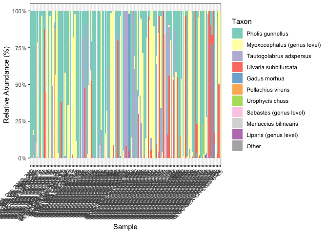
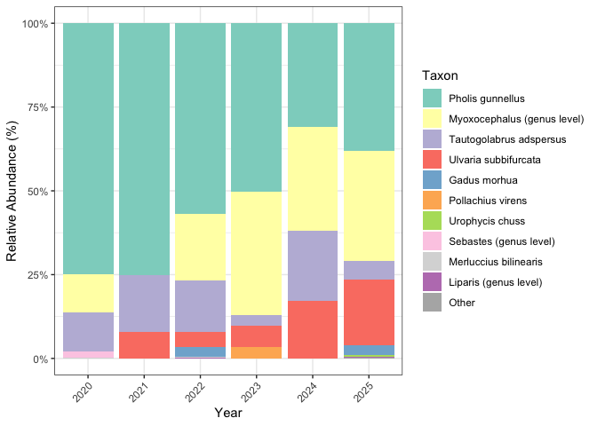
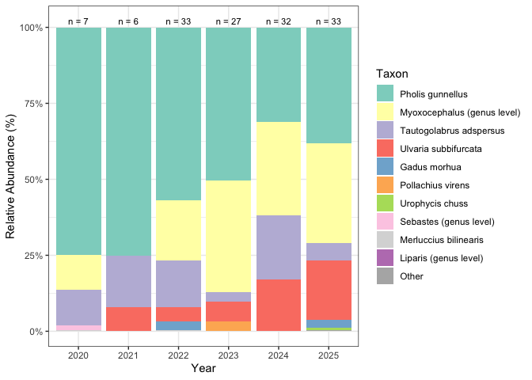

MiFish commands for processing Black Guillemot samples from Shoals
================
Gemma Clucas
2026-04-01

## 1. Set up

``` r
options(scipen=999)
knitr::opts_chunk$set(echo = TRUE, digits = 1)
knitr::opts_chunk$set(save_output = FALSE) # prevent outputs being over-written on knitting
library(tidyverse)
```

    ## ── Attaching core tidyverse packages ──────────────────────── tidyverse 2.0.0 ──
    ## ✔ dplyr     1.1.4     ✔ readr     2.1.5
    ## ✔ forcats   1.0.0     ✔ stringr   1.5.1
    ## ✔ ggplot2   4.0.0     ✔ tibble    3.2.1
    ## ✔ lubridate 1.9.3     ✔ tidyr     1.3.1
    ## ✔ purrr     1.0.2     
    ## ── Conflicts ────────────────────────────────────────── tidyverse_conflicts() ──
    ## ✖ dplyr::filter() masks stats::filter()
    ## ✖ dplyr::lag()    masks stats::lag()
    ## ℹ Use the conflicted package (<http://conflicted.r-lib.org/>) to force all conflicts to become errors

``` r
library(knitr)
library(qiime2R)
```

All analyses performed in the folder
`Fecal_metabarcoding/Black-Guillemots`. We have four plates on which the
samples have been sequenced: 24, 64, 81, and 146.

    conda activate qiime2-amplicon-2024.10 
    mkdir MiFish
    cd MiFish

Will have to redo everything once we have redone plate 146 with the
MiFish primers.

## 2. Import the data into QIIME2

    for K in 24 64 81 146; do
      qiime tools import\
        --type 'SampleData[PairedEndSequencesWithQuality]'\
        --input-path /Volumes/Data_SS1/MiFish/BLGU_Shoals/Plate$K/reads/ \
        --input-format CasavaOneEightSingleLanePerSampleDirFmt\
        --output-path demux_Plate$K.qza
    done


    for K in 24 64 81 146; do
      qiime demux summarize \
        --i-data demux_Plate$K.qza \
        --o-visualization demux_Plate$K.qzv
    done

## 3. Trim primers using cutadapt

The MiFish sequences are:

F primer: GTCGGTAAAACTCGTGCCAGC (21 bp)  
R primer: CATAGTGGGGTATCTAATCCCAGTTTG (27 bp)

### Trim 3’ ends first

At the 3’ end of the read, the primer will have been read through after
reading the MiFish amplicon. Look for the reverse complement of the
reverse primer in read 1 (—p-adapter-f) and the reverse complement of
the forward primer in R2 (—p-adapter-r).

F primer reverse complement: GCTGGCACGAGTTTTACCGAC  
R primer reverse complement: CAAACTGGGATTAGATACCCCACTATG

    for K in 24 64 81 146; do
      qiime cutadapt trim-paired \
        --i-demultiplexed-sequences demux_plate$K.qza \
        --p-adapter-f CAAACTGGGATTAGATACCCCACTATG \
        --p-adapter-r GCTGGCACGAGTTTTACCGAC \
        --o-trimmed-sequences trimd_Plate$K.qza \
        --verbose > cutadapt_out_Plate$K.txt
    done

To see how much data passed the filter for each sample:

    for K in 24 64 81 146; do
      grep "Total written (filtered):" cutadapt_out_Plate$K.txt 
    done

It looks like 77% is being kept for the first samples, but the samples
on plate 146 are at 100%, suggesting a problem with them.

**Trimming for MiniFish primers on Plate 146**

Try trimming for minifish instead

The MiniFish sequences are:

MiniFish_Ts_F: GTTATACGAGAGGCCCAAGTTG MiniFish_Ts_R:
TAAAGCCACTTTCGTGGTTG

    for K in 146; do
      qiime cutadapt trim-paired \
        --i-demultiplexed-sequences demux_plate$K.qza \
        --p-adapter-f CAACCACGAAAGTGGCTTTA \
        --p-adapter-r CAACTTGGGCCTCTCGTATAAC \
        --o-trimmed-sequences trimd_MiniFish_Plate$K.qza \
        --verbose > cutadapt_MiniFish_out_Plate$K.txt
    done

    for K in 146; do
      grep "Total written (filtered):" cutadapt_MiniFish_out_Plate$K.txt 
    done

**Yep the MiniFish primer sequences are there.**  
Most samples have about 50-60% data passing. Going to move all of the
files for Plate 146 that I already processed as if they were MiFish into
another folder. This includes producing the sequence taxonomy file after
merging and assigning taxonomy.

### Trim 5’ ends of reads

All R1 should begin with the forward primer: GTCGGTAAAACTCGTGCCAGC (21
bases). All R2 should begin with the reverse primer:
CATAGTGGGGTATCTAATCCCAGTTTG (27 bases).

Trim these with the following commands:

    for K in 24 64 81 146; do
      qiime cutadapt trim-paired \
        --i-demultiplexed-sequences trimd_Plate$K.qza \
        --p-front-f GTCGGTAAAACTCGTGCCAGC \
        --p-front-r CATAGTGGGGTATCTAATCCCAGTTTG \
        --o-trimmed-sequences trimd2_Plate$K.qza \
        --verbose > cutadapt_out2_Plate$K.txt
    done

To see how much data passed the filter for each sample:

    for K in 24 64 81 146; do
      grep "Total written (filtered):" cutadapt_out2_Plate$K.txt 
    done

88% consistently for first set of samples, but then 100% for plate 146
again.

**Redo 146 for MiniFish primers**

    for K in 146; do
      qiime cutadapt trim-paired \
        --i-demultiplexed-sequences trimd_Plate$K.qza \
        --p-front-f GTTATACGAGAGGCCCAAGTTG \
        --p-front-r TAAAGCCACTTTCGTGGTTG \
        --o-trimmed-sequences trimd2_MiniFish_Plate$K.qza \
        --verbose > cutadapt_MiniFish_out2_Plate$K.txt
    done

    for K in 146; do
      grep "Total written (filtered):" cutadapt_MiniFish_out2_Plate$K.txt 
    done

This is 92% now.

Make new visualisations to see how long the sequences are now.

    for K in 146; do
      qiime demux summarize \
        --i-data trimd2_plate$K.qza \
        --o-visualization trimd2_MiniFish_Plate$K.qzv
    done

## 4. Denoise with dada2

Prior to denoising, sequences are trimmed to a length of 133 and 138 bp
for forward and reverse reads, respectively, and merged requiring a
minimum overlap of 50 base pairs to prevent spurious overlaps. We found
these settings maximized the number of paired-end reads that could be
merged without losing sequences due to low-quality bases being retained
at the ends of reads while also preventing incorrect merging of
paired-end reads with shorter overlaps. The predicted overlap for the
MiFish amplicon with 250 bp paired-end sequencing and our trimming
parameters is roughly 80-90 bp in length, so setting a minimum of 50 bp
should be more than adequate (default is 12).

    for K in 24 64 81 146; do
      qiime dada2 denoise-paired \
        --i-demultiplexed-seqs trimd2_Plate$K.qza \
        --p-trunc-len-f 133 \
        --p-trunc-len-r 138 \
        --p-trim-left-f 0 \
        --p-trim-left-r 0 \
        --p-min-overlap 50 \
        --p-n-threads 8 \
        --o-representative-sequences rep-seqs_Plate$K \
        --o-table table_Plate$K \
        --o-denoising-stats denoise_Plate$K
    done

Create visualizations for the denoising stats, rep-seqs, and table.

    for K in 24 64 81 146; do  
      qiime metadata tabulate\
        --m-input-file denoise_Plate$K.qza\
        --o-visualization denoise_Plate$K.qzv
    done

    for K in 24 64 81 146; do  
      qiime feature-table tabulate-seqs \
        --i-data rep-seqs_Plate$K.qza \
        --o-visualization rep-seqs_Plate$K.qzv
    done

    for K in 24 64 81 146; do 
      qiime feature-table summarize \
        --i-table table_Plate$K.qza \
        --m-sample-metadata-file metadata.txt \
        --o-visualization table_Plate$K.qzv
    done

Denoise plate 146 separately using settings for MiniFish. Trimming reads
to 91bp since that is the average length of the MiniFish amplicon.

    for K in 146; do
      qiime dada2 denoise-paired \
        --i-demultiplexed-seqs trimd2_MiniFish_Plate$K.qza \
        --p-trunc-len-f 91 \
        --p-trunc-len-r 91 \
        --p-trim-left-f 0 \
        --p-trim-left-r 0 \
        --p-min-overlap 50 \
        --p-n-threads 8 \
        --o-representative-sequences rep-seqs_MiniFish_Plate$K \
        --o-table table_MiniFish_Plate$K \
        --o-denoising-stats denoise_MiniFish_Plate$K
    done

    for K in 146; do  
      qiime metadata tabulate\
        --m-input-file denoise_MiniFish_Plate$K.qza\
        --o-visualization denoise_MiniFish_Plate$K.qzv
    done

    for K in 146; do  
      qiime feature-table tabulate-seqs \
        --i-data rep-seqs_MiniFish_Plate$K.qza \
        --o-visualization rep-seqs_MiniFish_Plate$K.qzv
    done

    for K in 146; do 
      qiime feature-table summarize \
        --i-table table_MiniFish_Plate$K.qza \
        --m-sample-metadata-file metadata.txt \
        --o-visualization table_MiniFish_Plate$K.qzv
    done

## 5. Merge across plates

Not sure about merging MiFish and MiniFish amplicons, but let’s try

    qiime feature-table merge \
      --i-tables table_Plate24.qza \
      --i-tables table_Plate64.qza \
      --i-tables table_Plate81.qza \
      --i-tables table_MiniFish_Plate146.qza \
      --p-overlap-method sum \
      --o-merged-table merged-table.qza

    qiime feature-table summarize \
        --i-table merged-table.qza \
        --m-sample-metadata-file metadata.txt \
        --o-visualization merged-table
        
    qiime feature-table merge-seqs \
      --i-data rep-seqs_Plate24.qza \
      --i-data rep-seqs_Plate64.qza \
      --i-data rep-seqs_Plate81.qza \
      --i-data rep-seqs_MiniFish_Plate146.qza \
      --o-merged-data merged_rep-seqs.qza

    qiime feature-table tabulate-seqs \
      --i-data merged_rep-seqs.qza \
      --o-visualization merged_rep-seqs.qzv

## 6. Assign Taxonomy

### Make a custom reference database (not run)

Below is the code I used to create a custom reference database using the
RESCRIPt plugin. This database contains all fish 12S and mitochondrial
sequences available on GenBank at the time of curation (June 2025), in
addition to birds worked on in our lab as possible sources of
contamination and/or amplification of host DNA. Note that because I made
this database for a different project around the same time, I did not
include Suliformes in my search, so gannet DNA ends up being either
unassigned or matched to other species with low confidence.

Download sequences from GenBank, clean-up (using default settings), and
dereplicate:

    qiime rescript get-ncbi-data \
    --p-query '(12s[Title] OR \
                12S[Title] OR \
                "small subunit ribosomal RNA gene"[Title] OR \
                "mitochondrion, complete genome"[Title] AND \
                ("Chondrichthyes"[Organism] OR \
                "Dipnomorpha"[Organism] OR \
                "Actinopterygii"[Organism] OR \
                "Myxini"[Organism] OR \
                "Hyperoartia"[Organism] OR \
                "Coelacanthimorpha"[Organism] OR \
                fish[All Fields] OR \
                "Sphenisciformes"[Organism] OR \
                "Charadriiformes"[Organism] OR \
                "Procellariiformes"[Organism] OR \
                "Anseriformes"[Organism]))' \
      --p-n-jobs 5 \
      --o-sequences ncbi-refseqs-unfiltered.qza \
      --o-taxonomy ncbi-taxonomy-unfiltered.qza  

    qiime rescript cull-seqs \
      --i-sequences ncbi-refseqs-unfiltered.qza \
      --p-num-degenerates 5 \
      --p-homopolymer-length 8 \
      --p-n-jobs 4 \
      --o-clean-sequences ncbi-refseqs-culled
      
    qiime rescript dereplicate \
      --i-sequences ncbi-refseqs-culled.qza \
      --i-taxa ncbi-taxonomy-unfiltered.qza \
      --p-mode uniq \
      --p-threads 4 \
      --o-dereplicated-sequences ncbi-refseqs-culled-derep \
      --o-dereplicated-taxa ncbi-taxonomy-culled-derep

Export database out of qiime:

    mkdir editing_database

    qiime tools export \
      --input-path ncbi-taxonomy-culled-derep.qza \
      --output-path editing_database
      
    qiime tools export \
      --input-path ncbi-refseqs-culled-derep.qza \
      --output-path editing_database
      

This puts the sequences into `dna-sequences.fasta` and the taxonomy
strings into `taxonomy.tsv`. I added a single human mitochondrial
sequence that I downloaded from GenBank by pasting it into the fasta
file and adding the corresponding taxonomy string to the taxonomy file.
I did this by hand as I only need a single human sequence in my
reference database to identify possible human contamination.

Import back in to QIIME2:

    qiime tools import \
      --input-path editing_database/taxonomy.tsv \
      --output-path editing_database/ncbi-taxonomy-withHuman \
      --type 'FeatureData[Taxonomy]'
      
    qiime tools import \
      --input-path editing_database/dna-sequences.fasta \
      --output-path editing_database/ncbi-refseqs-withHuman \
      --type 'FeatureData[Sequence]'  

### Assign taxonomy using custom python script

The custom script uses an iterative BLAST method to take each
representative sequence from our samples and blast it 80 times against
the custom database, increasing the percent identity incrementally from
70 – 100 %, thus circumventing the limitation of the BLAST method, which
keeps only the first hit that meets the search criteria, rather than the
best hit.

The script is available
[here](https://github.com/GemmaClucas/UK-Gannets/blob/main/MiFish_2024/mktaxa_singlethreaded.py).

Usage:

    ./mktaxa_singlethreaded.py \
      ncbi-refseqs-withHuman.qza \
      ncbi-taxonomy-withHuman.qza \
      merged_rep-seqs.qza

    qiime metadata tabulate \
      --m-input-file superblast_taxonomy.qza \
      --o-visualization superblast_taxonomy

Make a barplot to eye-ball what’s in our samples:

    qiime taxa barplot \
      --i-table merged-table.qza \
      --i-taxonomy superblast_taxonomy.qza \
      --m-metadata-file metadata.txt \
      --o-visualization barplot_before_filtering.qzv

Plate 146 looks very different to the other samples as fish are
consistently being assigned to different taxa because of the use of the
wrong primers.

MiniFish primers have missed Atlantic herring in the mock community, but
there is no herring in the samples from any of the other years, so this
is hopefully not a problem. Are they missing other things though?

The MiniFish primers have also not amplified any guillemot DNA compared
to the MiFish primers, but the amount amplified by MiFish primers is
pretty minimal in most of the samples.

## 7. Remove non-prey reads

Filter out any sequences from the birds, mammals (human), and
unnassigned sequences.

    qiime taxa filter-table \
      --i-table merged-table.qza \
      --i-taxonomy superblast_taxonomy.qza \
      --p-exclude Unassigned,Aves,Mammalia \
      --o-filtered-table merged_table_noBirdsMammalsUnassigned.qza
      
    qiime feature-table summarize \
        --i-table merged_table_noBirdsMammalsUnassigned.qza \
        --m-sample-metadata-file metadata.txt \
        --o-visualization merged_table_noBirdsMammalsUnassigned

    qiime taxa barplot \
      --i-table merged_table_noBirdsMammalsUnassigned.qza \
      --i-taxonomy superblast_taxonomy.qza \
      --m-metadata-file metadata.txt \
      --o-visualization barplot_noBirdsMammalsUnassigned.qzv

Only one extraction blank and four field blanks left.

## 8. Read depth comparison

``` r
source("/Users/gc547/Dropbox/GitHub_copied/Fecal_metabarcoding/Scripts/read_depth_analysis.R")

results <- analyze_read_depths(
  feature_table_path = "MiFish/merged_table_noBirdsMammalsUnassigned.qza",
  taxonomy_path = "MiFish/superblast_taxonomy.qza",
  metadata_path = "MiFish/metadata.txt",
  output_folder = "MiFish/", # 
  save_output = TRUE
)
```

    ## `summarise()` has grouped output by 'SampleID', 'Type'. You can override using
    ## the `.groups` argument.
    ## `summarise()` has grouped output by 'Type'. You can override using the
    ## `.groups` argument.
    ## `summarise()` has grouped output by 'SampleID'. You can override using the
    ## `.groups` argument.

    ## 
    ## ### Read Depth Summary - Plate 64
    ## 
    ## 
    ## Table: Summary of read depths by sample type - Plate 64
    ## 
    ## |Type     |Plate | Mean Reads| Median Reads| SD Reads|  n| % of Sample Reads|
    ## |:--------|:-----|----------:|------------:|--------:|--:|-----------------:|
    ## |EXTBLANK |64    |       60.5|          121|       NA|  2|              0.06|
    ## |SAMPLE   |64    |   101925.7|        83869|  86192.8| 23|            100.00|
    ## |MOCK     |64    |   244731.0|       244731|       NA|  1|            240.11|
    ## |PCRBLANK |64    |        0.0|            0|      0.0|  1|              0.00|
    ## 
    ## 
    ## ### Read Depth Summary - Plate 146
    ## 
    ## 
    ## Table: Summary of read depths by sample type - Plate 146
    ## 
    ## |Type     |Plate | Mean Reads| Median Reads| SD Reads|  n| % of Sample Reads|
    ## |:--------|:-----|----------:|------------:|--------:|--:|-----------------:|
    ## |EXTBLANK |146   |       0.00|            0|      0.0|  6|              0.00|
    ## |FLDBLANK |146   |     367.33|         1102|       NA|  3|              0.19|
    ## |SAMPLE   |146   |  193971.13|       171499| 149740.9| 83|            100.00|
    ## |MOCK     |146   |  321449.00|       321449|       NA|  1|            165.72|
    ## |PCRBLANK |146   |       0.00|            0|      0.0|  2|              0.00|
    ## 
    ## 
    ## ### Read Depth Summary - Plate 81
    ## 
    ## 
    ## Table: Summary of read depths by sample type - Plate 81
    ## 
    ## |Type     |Plate | Mean Reads| Median Reads| SD Reads|  n| % of Sample Reads|
    ## |:--------|:-----|----------:|------------:|--------:|--:|-----------------:|
    ## |EXTBLANK |81    |       0.00|          0.0|      0.0|  3|              0.00|
    ## |FLDBLANK |81    |     110.40|        131.0|    111.4|  5|              0.12|
    ## |SAMPLE   |81    |   95148.39|      48243.5| 102896.7| 28|            100.00|
    ## |MOCK     |81    |   86612.00|      86612.0|       NA|  1|             91.03|
    ## |PCRBLANK |81    |       0.00|          0.0|      0.0|  1|              0.00|
    ## 
    ## 
    ## ### Read Depth Summary - Plate 24
    ## 
    ## 
    ## Table: Summary of read depths by sample type - Plate 24
    ## 
    ## |Type     |Plate | Mean Reads| Median Reads| SD Reads|  n| % of Sample Reads|
    ## |:--------|:-----|----------:|------------:|--------:|--:|-----------------:|
    ## |EXTBLANK |24    |       0.00|            0|     0.00|  1|              0.00|
    ## |SAMPLE   |24    |   86619.43|        76893| 67848.13|  7|            100.00|
    ## |MOCK     |24    |  232083.00|       232083|       NA|  1|            267.93|
    ## |PCRBLANK |24    |       0.00|            0|     0.00|  1|              0.00|
    ## 
    ## 
    ## ### Read Depth Summary - All Plates Combined
    ## 
    ## 
    ## Table: Summary of read depths by sample type - All Plates Combined
    ## 
    ## |Type     | Mean Reads| Median Reads|  SD Reads|   n| % of Sample Reads|
    ## |:--------|----------:|------------:|---------:|---:|-----------------:|
    ## |EXTBLANK |      10.08|        121.0|        NA|  12|              0.01|
    ## |FLDBLANK |     206.75|        221.5|    467.92|   8|              0.13|
    ## |SAMPLE   |  154002.74|     121336.0| 137303.14| 141|            100.00|
    ## |MOCK     |  221218.75|     238407.0|  98040.70|   4|            143.65|
    ## |PCRBLANK |       0.00|          0.0|      0.00|   5|              0.00|

The extraction-, field-, and PCR-banks all have barely any reads in
them.

## 9. Calculate alpha rarefaction curves

First collapsing at the species level (level 7) so that we can look at
species richness within the samples, rather than ASV richness, which is
the default.

    qiime taxa collapse \
      --i-table merged_table_noBirdsMammalsUnassigned.qza \
      --i-taxonomy superblast_taxonomy.qza \
      --p-level 7 \
      --o-collapsed-table merged_table_noBirdsMammalsUnassigned_collapsed.qza

    qiime diversity alpha-rarefaction \
      --i-table merged_table_noBirdsMammalsUnassigned_collapsed.qza \
      --m-metadata-file metadata.txt \
      --p-min-depth 100 \
      --p-max-depth 5000 \
      --o-visualization alpha-rarefaction-100-5000

Species richness reaches a plateau somewhere between 100 and 500 reads.
Zoom in on that region.

    qiime diversity alpha-rarefaction \
      --i-table merged_table_noBirdsMammalsUnassigned_collapsed.qza \
      --m-metadata-file metadata.txt \
      --p-min-depth 50 \
      --p-max-depth 500 \
      --o-visualization alpha-rarefaction-50-500

Species richness plateaus in the samples at 200 reads, so just drop
samples with fewer than 200. This drops the final extraction blank, two
of the field blanks, and three samples. Two field blanks remain with 312
and 1,102 reads.

## 10. Filtering

### Drop mock community, blanks, and samples with fewer than 150 reads

    qiime feature-table filter-samples \
      --i-table merged_table_noBirdsMammalsUnassigned.qza \
      --p-min-frequency 200 \
      --m-metadata-file metadata.txt \
      --p-where "Type='SAMPLE'" \
      --o-filtered-table merged_table_noBirdsMammalsUnassigned_minfreq200
      
    qiime taxa barplot \
      --i-table merged_table_noBirdsMammalsUnassigned_minfreq200.qza  \
      --m-metadata-file metadata.txt \
      --i-taxonomy superblast_taxonomy.qza \
      --o-visualization barplot_noBirdsMammalsUnassigned_minfreq200

### 1% Abundance filtering

Note that I turned this into a script when I was working on Sabiya
Sheikh’s 2025 gulls and shags from the UK, but I deleted it from that
repo for consistency with how I had filtered her 2024 samples. But this
script will now set to zero the abundance of any taxon in a sample that
has an RRA less than 1% in that sample. It will also remove taxa that
never reach an RRA of more than 1% in any sample.

``` r
# Set arguments
args <- list(
  feature_table = "MiFish/merged_table_noBirdsMammalsUnassigned_minfreq200.qza",
  taxonomy = "MiFish/superblast_taxonomy.qza",
  metadata = "MiFish/metadata.txt",
  output_dir = "MiFish/",
  abundance_threshold = 0.01
)

# Source the script
source("/Users/gc547/Dropbox/GitHub_copied/Fecal_metabarcoding/Scripts/Abundance_filtering.R")

# Run
process_data(
  feature_table_path = args$feature_table,
  taxonomy_path = args$taxonomy,
  metadata_path = args$metadata,
  output_dir = args$output_dir,
  abundance_threshold = args$abundance_threshold
)
```

    ## `summarise()` has grouped output by 'SampleID'. You can override using the
    ## `.groups` argument.

    ## 
    ## Summary Statistics:
    ## Original number of features: 684 
    ## Number of features after filtering: 601 
    ## Number of features removed: 83 
    ## 
    ## Number of unique taxa before filtering: 56 
    ## Number of unique taxa after filtering: 17 
    ## Number of taxa removed: 39 
    ## 
    ## Total reads before filtering: 21714149 
    ## Total reads after filtering: 21662535 
    ## Percentage of reads retained: 99.76 %

Import back into Qiime

    # Import feature table
    qiime tools import \
      --input-path filtered_feature_table.biom \
      --type 'FeatureTable[Frequency]' \
      --input-format BIOMV100Format \
      --output-path filtered_table_minfreq200_minabund1.qza

    # Import taxonomy
    qiime tools import \
      --input-path filtered_taxonomy.tsv \
      --type 'FeatureData[Taxonomy]' \
      --input-format TSVTaxonomyFormat \
      --output-path filtered_taxonomy_minfreq200_minabund1.qza

Make a barplot with the filtered data

    qiime taxa barplot \
      --i-table filtered_table_minfreq200_minabund1.qza \
      --i-taxonomy filtered_taxonomy_minfreq200_minabund1.qza \
      --m-metadata-file metadata.txt \
      --o-visualization barplot_minfreq200_minabund1.qzv

## 11. Taxonomy edits

Remake the sequence taxonomy file now that we have filtered out low
abundance taxa.

First, filter down the rep-seqs to just those that are found in our
remaining samples after abundance filtering.

    qiime feature-table filter-seqs \
      --i-data merged_rep-seqs.qza \
      --i-table filtered_table_minfreq200_minabund1.qza \
      --o-filtered-data filtered_rep-seqs_minfreq200_minabund1.qza

Next make a table with sequences and taxonomy strings:

    qiime metadata tabulate \
      --m-input-file filtered_rep-seqs_minfreq200_minabund1.qza \
      --m-input-file filtered_taxonomy_minfreq200_minabund1.qza \
      --o-visualization sequence_taxonomy_minfreq200_minabund1.qzv

A few notes on the taxonomy edits:  
\* Pacific cod changed to Atlantic cod.  
\* Atlantic wolffish changed to wolffish sp. although the Atlantic
wolffish is by far the most common in the GoM out of the three
possibilities according to Bigelow and Schroeder.  
\* Three sculpins (Myoxocephalus sp.) are possible in the GoM - all
common and genetically alike: longhorn, shorthorn, and grubby.  
\* There is only one wrymouth found in the GoM according to Bigelow and
Schroeder.  
\* There are four Liparis spp in the GoM, but none were on genbank.  
\* The redfish (Sebastes) species is most likely acadian redfish (S.
fasciatus).

Make edits after reading the taxonomy artifact into R.

``` r
tax <- read_qza("MiFish/superblast_taxonomy.qza")

tax$data$Taxon <- tax$data$Taxon %>% 
  str_replace_all("g__Gadus;s__chalcogrammus", "g__Gadus;s__morhua") %>%       # Atlantic cod
  str_replace_all("g__Anarhichas;s__lupus", "g__Anarhichas;s__") %>%       # Wolffish sp. 
  str_replace_all("g__Microcottus;s__sellaris", "g__Myoxocephalus;s__") %>%       # Sculpins sp.
  str_replace_all("g__Myoxocephalus;s__aenaeus", "g__Myoxocephalus;s__") %>%       # Sculpins sp.
  str_replace_all("g__Myoxocephalus;s__octodecemspinosus", "g__Myoxocephalus;s__") %>%       # Sculpins sp. 
  str_replace_all("g__Cryptacanthodes;s__bergi", "g__Cryptacanthodes;s__maculatus") %>%       # Wrymouth
  str_replace_all("g__Liparis;s__miostomus", "g__Liparis;s__") %>%       # four possible Liparis species in GoM
  str_replace_all("g__Pholis;s__crassispina", "g__Pholis;s__gunnellus") %>%       # Rock gunnell
  str_replace_all("g__Sebastes;s__mentella", "g__Sebastes;s__") %>%       # Most likely acadian redfish (S. fasciatus) according to Bigelow & Schoeder
  str_replace_all("g__Opisthocentrus;s__ocellatus", "g__Ulvaria;s__subbifurcata") %>%       # Radiated shanny 
  str_replace_all("g__Ammodytes;s__dubius", "g__Ammodytes;s__")       # Sandlance
```

Write-out the edited taxonomy file:

``` r
if(knitr::opts_chunk$get("save_output")) {
  write.table(tax$data,
              quote = FALSE,
              row.names = FALSE,
              file = "MiFish/superblast_taxonomy_edited.tsv",
              sep = "\t")
}
```

Remove the period and reload into qiime (run in terminal). Remake
barplots with updated taxonomy.

    sed -i.bak 's/Feature.ID/Feature ID/g' superblast_taxonomy_edited.tsv

    conda activate qiime2-amplicon-2024.10 

    qiime tools import \
      --input-path superblast_taxonomy_edited.tsv \
      --output-path superblast_taxonomy_edited.qza \
      --type 'FeatureData[Taxonomy]'
      
    qiime metadata tabulate \
      --m-input-file superblast_taxonomy_edited.qza \
      --o-visualization superblast_taxonomy_edited
      
    qiime taxa barplot \
      --i-table filtered_table_minfreq200_minabund1.qza \
      --i-taxonomy superblast_taxonomy_edited.qza \
      --m-metadata-file metadata.txt \
      --o-visualization barplot_noBirdsMammalsUnassigned_minfreq200_minabund1_taxedit.qzv

## 12. Create RRA table

I have modified this from the code I had for the UK gannet project. I
had to remove the 1% abundance filtering and changed it to keep the
sample metadata in the output.

``` r
library(qiime2R)

# Read in the QIIME 2 artifacts and metadata
feature_table <- read_qza("MiFish/filtered_table_minfreq200_minabund1.qza")
taxonomy_data <- read_qza("MiFish/superblast_taxonomy_edited.qza")
metadata <- read_q2metadata("MiFish/metadata.txt")

# Convert feature table to data frame
feature_table_df <- as.data.frame(feature_table$data) %>%
  rownames_to_column("FeatureID")

# Clean up taxonomy data
taxonomy_clean <- taxonomy_data$data %>%
  parse_taxonomy() %>%  # This splits the taxonomy string into columns
  rownames_to_column("FeatureID")

# Reshape feature table to long format
feature_long <- feature_table_df %>%
  gather(key = "SampleID", value = "Abundance", -FeatureID)

# Merge all data together
complete_data <- feature_long %>%
  left_join(taxonomy_clean, by = "FeatureID") %>%
  left_join(metadata, by = "SampleID")

# Modify the species_level_data creation to handle different taxonomic levels
species_level_data <- complete_data %>%
  mutate(TaxonName = case_when(
    !is.na(Species.x) ~ paste(Genus, Species.x, sep = " "),
    !is.na(Genus) ~ paste(Genus, "(genus level)", sep = " "),
    !is.na(Family) ~ paste(Family, "(family level)", sep = " "),
    !is.na(Order) ~ paste(Order, "(order level)", sep = " "),
    !is.na(Class) ~ paste(Class, "(class level)", sep = " "),
    !is.na(Phylum) ~ paste(Phylum, "(phylum level)", sep = " "),
    TRUE ~ "Unassigned"
  )) %>%
  group_by(SampleID, TaxonName, Type, Year, Age, Colony, Plate, Species.y) %>%
  summarise(Abundance = sum(Abundance)) %>%
  ungroup()
```

    ## `summarise()` has grouped output by 'SampleID', 'TaxonName', 'Type', 'Year',
    ## 'Age', 'Colony', 'Plate'. You can override using the `.groups` argument.

``` r
# Calculate relative abundances
modified_species_data <- species_level_data %>%
  group_by(SampleID) %>%
  # Calculate percentages
  mutate(TotalSampleReads = sum(Abundance),
         RelativeAbundance = (Abundance / TotalSampleReads) * 100) %>%
  ungroup()


# Pivot to wide format with samples as rows, taxa as columns, but keep other metadata
pivot_samples_wide <- function(data) {
  
  # Pivot wider: SampleID becomes rows, TaxonName becomes columns
  abundance_wide <- data %>%
    pivot_wider(id_cols = c(SampleID, Type, Year, Age, Colony, Plate, Species.y),
                names_from = TaxonName, 
                values_from = RelativeAbundance,
                values_fill = 0)
  
  return(abundance_wide)
}

# Apply the function
wide_relabund <- pivot_samples_wide(modified_species_data)

# write-out
if(knitr::opts_chunk$get("save_output")) {
  write.csv(wide_relabund,
            "MiFish/relative_abundance_table.csv",
            row.names = FALSE)
}
```

This works and now keeps the sample metadata in the final table.

## 13. Quick plot

Plotting each sample:

``` r
# To keep top N taxa and group others
top_taxa_RRA <- modified_species_data %>%
  group_by(TaxonName) %>%
  summarise(total_RRA = sum(RelativeAbundance)) %>%
  arrange(desc(total_RRA)) %>%
  slice_head(n =10) %>%  # Keeping all 13 for now
  pull(TaxonName)

# Create color palette
n_colors_needed <- length(top_taxa_RRA)
distinct_colors <- RColorBrewer::brewer.pal(max(3, min(n_colors_needed, 12)), "Set3")[1:n_colors_needed]
all_colors <- c(distinct_colors, "grey70")
names(all_colors) <- c(top_taxa_RRA, "Other")

# stacked bar for all samples
modified_species_data %>% 
  mutate(colour = ifelse(TaxonName %in% top_taxa_RRA, TaxonName, "Other"),
         colour = factor(colour, levels = c(top_taxa_RRA, "Other"))) %>% 
  ggplot(aes(x = SampleID, y = RelativeAbundance, fill = colour)) +
  geom_bar(stat = "identity", position = "fill") +
  theme_bw() +
  theme(axis.text.x = element_text(angle = 45, hjust = 1)) +
  labs(x = "Sample", 
       y = "Relative Abundance (%)",
       fill = "Taxon") +
  scale_y_continuous(labels = scales::percent) +
  scale_fill_manual(values = all_colors)
```

<!-- -->

``` r
#ggsave("MiFish/relative_abundance_per_sample.pdf", width = 12, height = 8)
```

## 14. RRA summary

Make a table.

``` r
# Tabulate mean RRA for each species
modified_species_data %>% group_by(TaxonName, Year) %>% 
  summarise(RRA_percent = mean(RelativeAbundance)) %>% 
  arrange(Year, -RRA_percent, TaxonName, ) %>% 
  mutate(across(where(is.numeric), round, 2)) %>% 
  kable()
```

    ## `summarise()` has grouped output by 'TaxonName'. You can override using the
    ## `.groups` argument.

    ## Warning: There was 1 warning in `mutate()`.
    ## ℹ In argument: `across(where(is.numeric), round, 2)`.
    ## ℹ In group 1: `TaxonName = "Ammodytes (genus level)"`.
    ## Caused by warning:
    ## ! The `...` argument of `across()` is deprecated as of dplyr 1.1.0.
    ## Supply arguments directly to `.fns` through an anonymous function instead.
    ## 
    ##   # Previously
    ##   across(a:b, mean, na.rm = TRUE)
    ## 
    ##   # Now
    ##   across(a:b, \(x) mean(x, na.rm = TRUE))

| TaxonName                   | Year | RRA_percent |
|:----------------------------|:-----|------------:|
| Pholis gunnellus            | 2020 |       74.78 |
| Tautogolabrus adspersus     | 2020 |       11.69 |
| Myoxocephalus (genus level) | 2020 |       11.53 |
| Sebastes (genus level)      | 2020 |        1.70 |
| Merluccius bilinearis       | 2020 |        0.30 |
| Ammodytes (genus level)     | 2020 |        0.00 |
| Anarhichas (genus level)    | 2020 |        0.00 |
| Cryptacanthodes maculatus   | 2020 |        0.00 |
| Gadus morhua                | 2020 |        0.00 |
| Liparis (genus level)       | 2020 |        0.00 |
| Pollachius virens           | 2020 |        0.00 |
| Ulvaria subbifurcata        | 2020 |        0.00 |
| Urophycis chuss             | 2020 |        0.00 |
| Pholis gunnellus            | 2021 |       75.07 |
| Tautogolabrus adspersus     | 2021 |       17.05 |
| Ulvaria subbifurcata        | 2021 |        7.89 |
| Ammodytes (genus level)     | 2021 |        0.00 |
| Anarhichas (genus level)    | 2021 |        0.00 |
| Cryptacanthodes maculatus   | 2021 |        0.00 |
| Gadus morhua                | 2021 |        0.00 |
| Liparis (genus level)       | 2021 |        0.00 |
| Merluccius bilinearis       | 2021 |        0.00 |
| Myoxocephalus (genus level) | 2021 |        0.00 |
| Pollachius virens           | 2021 |        0.00 |
| Sebastes (genus level)      | 2021 |        0.00 |
| Urophycis chuss             | 2021 |        0.00 |
| Pholis gunnellus            | 2022 |       56.94 |
| Myoxocephalus (genus level) | 2022 |       19.82 |
| Tautogolabrus adspersus     | 2022 |       15.42 |
| Ulvaria subbifurcata        | 2022 |        4.54 |
| Gadus morhua                | 2022 |        2.84 |
| Merluccius bilinearis       | 2022 |        0.27 |
| Liparis (genus level)       | 2022 |        0.14 |
| Ammodytes (genus level)     | 2022 |        0.04 |
| Anarhichas (genus level)    | 2022 |        0.00 |
| Cryptacanthodes maculatus   | 2022 |        0.00 |
| Pollachius virens           | 2022 |        0.00 |
| Sebastes (genus level)      | 2022 |        0.00 |
| Urophycis chuss             | 2022 |        0.00 |
| Pholis gunnellus            | 2023 |       50.38 |
| Myoxocephalus (genus level) | 2023 |       36.78 |
| Ulvaria subbifurcata        | 2023 |        6.40 |
| Pollachius virens           | 2023 |        3.28 |
| Tautogolabrus adspersus     | 2023 |        3.09 |
| Gadus morhua                | 2023 |        0.06 |
| Ammodytes (genus level)     | 2023 |        0.00 |
| Anarhichas (genus level)    | 2023 |        0.00 |
| Cryptacanthodes maculatus   | 2023 |        0.00 |
| Liparis (genus level)       | 2023 |        0.00 |
| Merluccius bilinearis       | 2023 |        0.00 |
| Sebastes (genus level)      | 2023 |        0.00 |
| Urophycis chuss             | 2023 |        0.00 |
| Pholis gunnellus            | 2024 |       31.03 |
| Myoxocephalus (genus level) | 2024 |       30.77 |
| Tautogolabrus adspersus     | 2024 |       21.04 |
| Ulvaria subbifurcata        | 2024 |       17.16 |
| Ammodytes (genus level)     | 2024 |        0.00 |
| Anarhichas (genus level)    | 2024 |        0.00 |
| Cryptacanthodes maculatus   | 2024 |        0.00 |
| Gadus morhua                | 2024 |        0.00 |
| Liparis (genus level)       | 2024 |        0.00 |
| Merluccius bilinearis       | 2024 |        0.00 |
| Pollachius virens           | 2024 |        0.00 |
| Sebastes (genus level)      | 2024 |        0.00 |
| Urophycis chuss             | 2024 |        0.00 |
| Pholis gunnellus            | 2025 |       38.19 |
| Myoxocephalus (genus level) | 2025 |       32.80 |
| Ulvaria subbifurcata        | 2025 |       19.52 |
| Tautogolabrus adspersus     | 2025 |        5.61 |
| Gadus morhua                | 2025 |        2.77 |
| Urophycis chuss             | 2025 |        0.73 |
| Ammodytes (genus level)     | 2025 |        0.14 |
| Cryptacanthodes maculatus   | 2025 |        0.11 |
| Anarhichas (genus level)    | 2025 |        0.07 |
| Liparis (genus level)       | 2025 |        0.06 |
| Merluccius bilinearis       | 2025 |        0.00 |
| Pollachius virens           | 2025 |        0.00 |
| Sebastes (genus level)      | 2025 |        0.00 |

Make a plot.

``` r
modified_species_data %>% group_by(TaxonName, Year) %>% 
  summarise(RRA_percent = mean(RelativeAbundance)) %>% 
  mutate(colour = ifelse(TaxonName %in% top_taxa_RRA, TaxonName, "Other"),
         colour = factor(colour, levels = c(top_taxa_RRA, "Other"))) %>% 
  ggplot(aes(x = Year, y = RRA_percent, fill = colour)) +
  geom_bar(stat = "identity", position = "fill") +
  theme_bw() +
  theme(axis.text.x = element_text(angle = 45, hjust = 1)) +
  labs(x = "Year", 
       y = "Relative Abundance (%)",
       fill = "Taxon") +
  scale_y_continuous(labels = scales::percent) +
  scale_fill_manual(values = all_colors)
```

    ## `summarise()` has grouped output by 'TaxonName'. You can override using the
    ## `.groups` argument.

<!-- -->

``` r
#ggsave("MiFish/relative_abundance_per_year.pdf", width = 12, height = 8)
```

Tabulate number of samples per year

``` r
modified_species_data %>% group_by(Year) %>% 
  summarise(n = n_distinct(SampleID))
```

    ## # A tibble: 6 × 2
    ##   Year      n
    ##   <fct> <int>
    ## 1 2020      7
    ## 2 2021      6
    ## 3 2022     33
    ## 4 2023     27
    ## 5 2024     32
    ## 6 2025     33

Add sample sizes to plot

``` r
# Calculate sample sizes
sample_sizes <- modified_species_data %>% 
  group_by(Year) %>% 
  summarise(n_samples = n_distinct(SampleID))


modified_species_data %>% group_by(TaxonName, Year) %>% 
  summarise(RRA_percent = mean(RelativeAbundance)) %>% 
  mutate(colour = ifelse(TaxonName %in% top_taxa_RRA, TaxonName, "Other"),
         colour = factor(colour, levels = c(top_taxa_RRA, "Other"))) %>% 
  ggplot(aes(x = Year, y = RRA_percent, fill = colour)) +
  geom_bar(stat = "identity", position = "fill") +
  geom_text(data = sample_sizes, 
            aes(x = Year, y = 1.02, label = paste("n =", n_samples)), 
            inherit.aes = FALSE, 
            hjust = 0.5, size = 3) +
  theme_bw() +
  labs(x = "Year", 
       y = "Relative Abundance (%)",
       fill = "Taxon") +
  scale_y_continuous(labels = scales::percent) + # 
  scale_fill_manual(values = all_colors)
```

    ## `summarise()` has grouped output by 'TaxonName'. You can override using the
    ## `.groups` argument.

<!-- -->
